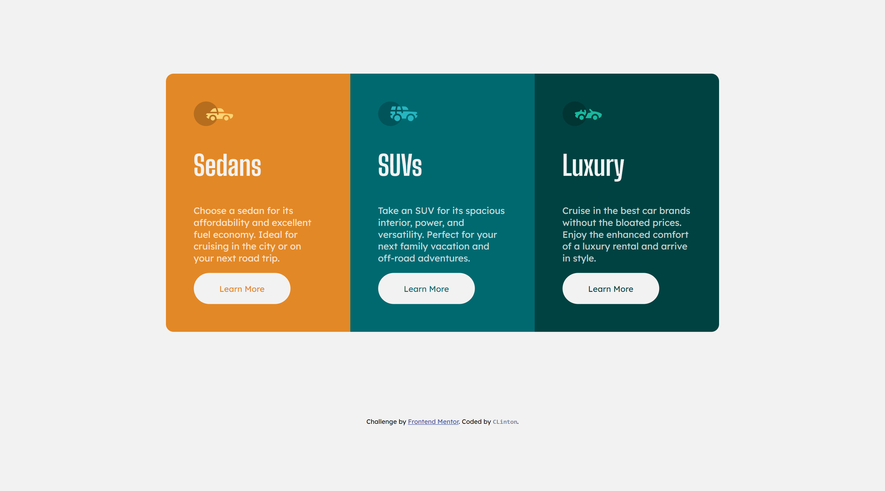
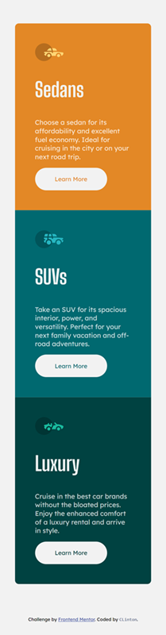

# Frontend Mentor - 3-column preview card component solution

This is a solution to the [3-column preview card component challenge on Frontend Mentor](https://www.frontendmentor.io/challenges/3column-preview-card-component-pH92eAR2-). Frontend Mentor challenges help you improve your coding skills by building realistic projects. 

## Table of contents

- [Overview](#overview)
  - [The challenge](#the-challenge)
  - [Screenshot](#screenshot)
  - [Links](#links)
- [My process](#my-process)
  - [Built with](#built-with)
  - [What I learned](#what-i-learned)
  - [Continued development](#continued-development)
  - [Useful resources](#useful-resources)
- [Author](#author)


## Overview

This addresses the challenge of the [3-column preview card component challenge on Frontend Mentor], and it has been coded by clintt-09.

Two screenshots are available, showcasing the Desktop and Mobile views. Additionally, there are provided links to both the GitHub repository and the live site hosted on Netlify.

### The challenge

Users should be able to:

- View the optimal layout depending on their device's screen size
- See hover states for interactive elements

### Screenshot

Desktop view (1440 x 800)




Mobile view (375 x 1052)



### Links

- Solution URL: [Solution on Frontend Mentor](https://www.frontendmentor.io/solutions/responsive-card-component-with-flexbox-and-media-queries-zUTD2mBOq8)
- Live Site URL: [ace-5.netlify.app](https://ace-5.netlify.app/)

## My process
Here are the tools and technologies I employed to address this challenge, insights gained throughout the problem-solving journey, areas in which I aspire to enhance my skills in the coming days, and articles that proved beneficial for me, potentially aiding others in overcoming similar challenges on Frontend Mentor or elsewhere.

This is the approach I took to address this challenge. 

### Built with

- Semantic HTML5 markup
- CSS custom properties
- Flexbox
- Mobile-first workflow

### What I learned

Once again, the 'max-width' CSS property is very useful in responsive design. This is my best solution yet as it is Responsive NO matter what device the user is using.

Here is a CSS rule I used to make sure the content doesn't look too goofy:

```css
.text div{
    padding: 3rem;
    max-width: 634.5px;
}
```

### Continued development

I'm finally getting a firm grip on responsive design (With CSS FLexbox and Media queries)...I'll get there soon...


### Useful resources

- [MDN Web Docs](https://developer.mozilla.org/en-US/) - This is was a clear and concise documentation that helped me lots during this challenge. I believe every web developer is familiar with it but I still need to mention it in case.

## Author

- Frontend Mentor - [@clintt-09](https://www.frontendmentor.io/profile/clintt-09)
- Twitter - [@clinttfr](https://www.twitter.com/clinttfr)

